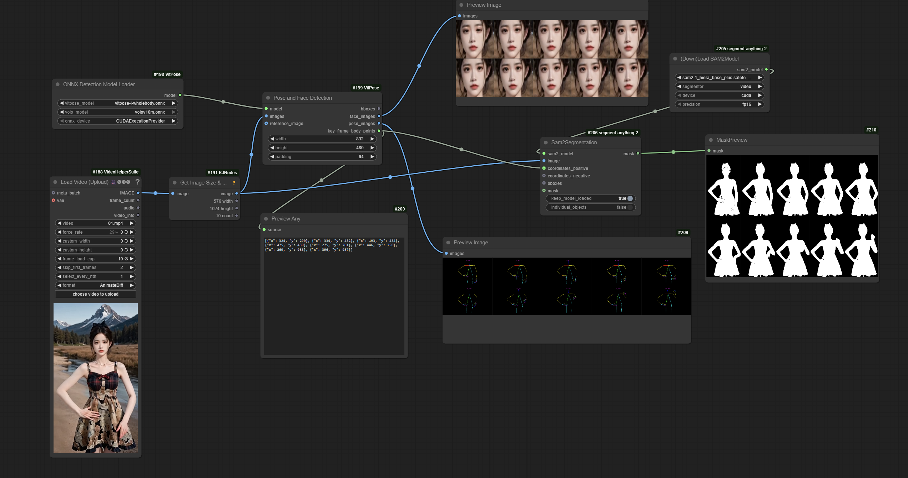

## ComfyUI helper nodes for [Wan video 2.2 Animate preprocessing](https://github.com/Wan-Video/Wan2.2/tree/main/wan/modules/animate/preprocess)

# !!WORK IN PROGRESS!!

Expect the nodes to change.

Nodes to run the ViTPose model, get face crops and keypoint list for SAM2 segmentation.

Models:

to `ComfyUI/models/detection` (subject to change in the future)

YOLO:

https://huggingface.co/Wan-AI/Wan2.2-Animate-14B/blob/main/process_checkpoint/det/yolov10m.onnx

ViTPose ONNX:

Original code uses the Huge variant, which is over the 2GB ONNX model size limit so it's split to multiple files.
Large model seems to work fine too:

https://huggingface.co/JunkyByte/easy_ViTPose/tree/main/onnx/wholebody

Combined data to single .bin file for the Huge model, both files need to be in same directory, and the onnx file selected in the model loader:

https://huggingface.co/Kijai/vitpose_comfy/tree/main/onnx

