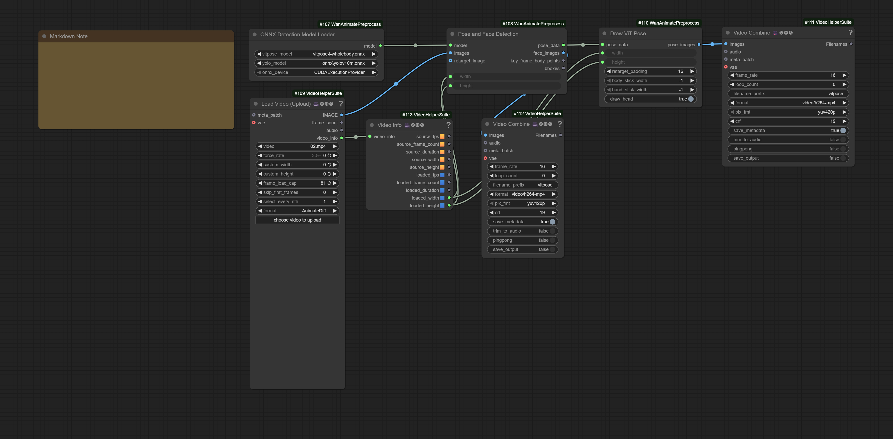

## ComfyUI helper nodes for [Wan video 2.2 Animate preprocessing](https://github.com/Wan-Video/Wan2.2/tree/main/wan/modules/animate/preprocess)

Nodes to run the ViTPose model, get face crops and keypoint list for SAM2 segmentation.

Models:

to `ComfyUI/models/detection` (subject to change in the future)

YOLO:

https://huggingface.co/Wan-AI/Wan2.2-Animate-14B/blob/main/process_checkpoint/det/yolov10m.onnx

ViTPose ONNX:

Use either the Large model from here:

https://huggingface.co/JunkyByte/easy_ViTPose/tree/main/onnx/wholebody

Or the Huge model like in the original code, it's split into two files due to ONNX file size limit:

Both files need to be in same directory, and the onnx file selected in the model loader:

`vitpose_h_wholebody_data.bin` and `vitpose_h_wholebody_model.onnx`

https://huggingface.co/Kijai/vitpose_comfy/tree/main/onnx

